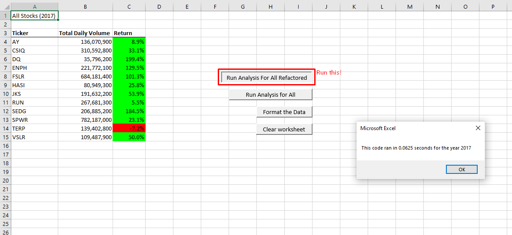
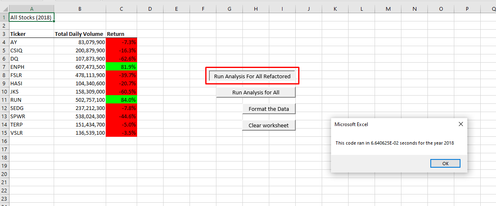

# Module-2-Challenge
# Name: Tanvir Rahman

# stock-analysis
[This is the link to my excel file!](/VBA_Challenge.xlsm)
## Overview of Project
I created a index variable for ticker that allows me to access element in the arrays that I have created and add data to it accordingly using for loops. I created three additional arrays: tickerVolumes, tickerStartingPrices, and tickerEndingPrices of size 12. I set the values of every element of tickerVolumes array to zero. I've created another for loop that loops through the entire data sheet and updates tickerVolumes, tickerStartingPrices, and tickerEndingPrices with the use of the index I initially created. Finally, I activate my stock analysis sheet and display the analysis of the data there. 
### Purpose
In module 2 lessons, I created a code for Steve so that he can run analysis on his 2017 and 2018 stock data. The code works perfectly. However, if Steve were to collect an enormous amount of data, such as the data of the entire stock market over the past few years, this code will run the analysis but take too long. Thus, I was tasked to refactor my code and improve its efficiency by lowering the runtime.  

## Results

---

    
According to the analysis done on both years, stocks in 2017 performed positively on all except "TERP". However, the following year, 2018, only two stocks had a positive performance, namely, "ENPH", and "RUN". I also noticed that there was increase in the total volume of trade in 2018 on the stocks that performed very well in 2017.
Run time of the refractored script was improved by almost 10 times (10 times faster!) compared with the original script for both 2017, and 2018. This is due to the fact that we only had to create space for three arrays on the ram, compared to the original script where we had to create space in ram for every single data we looped over. Also, refractored script was faster because we only had to loop through the main data only once, whereas for the original data, we looped through the main data 11 times for 11 tickers. 

## Summary
### Advantages and Disadvantages of Refactoring Code
Refactoring code enables the code to run faster and efficient. It may also be easier to read and understand by the reader. However, the disadvantage of refactoring code is how time consuming the process is. Initially when we write out code, we write it so that it works and executes as intended but then we have to spend extra time on refactoring the code - thinking of how to improve and make the code more efficient.

### How do these pros and cons apply to refactoring the original VBA script?
Refactoring the original script made it run almost ten times faster and also easier to read as it didn't have a nested loop! However, I had to spend a good amount of time and seek additional help from "Ask BCS" teaching assistants to understand how to make use of the indexTicker variable on all three arrays. 
